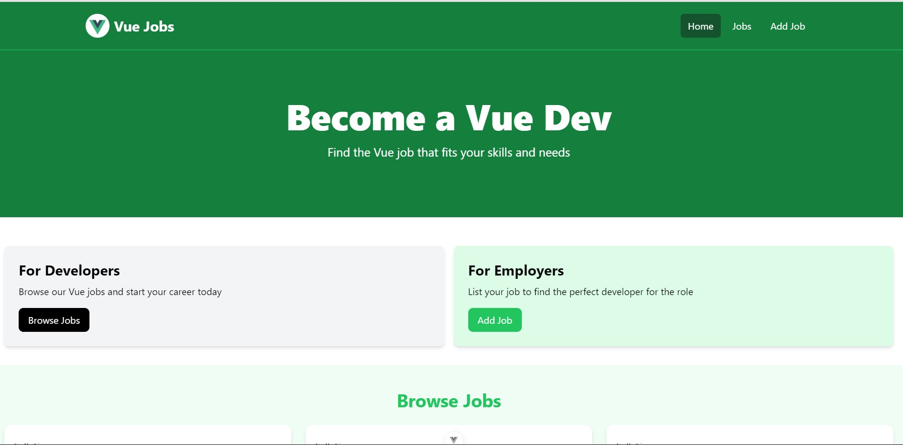
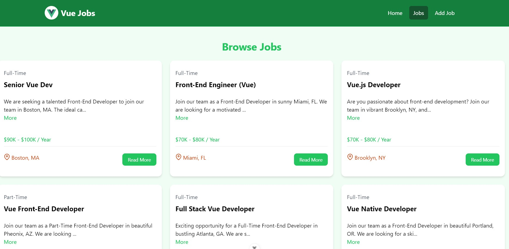

# VueApp for Job Listings

This is an implementation of a job listing web app using vue js for frontend.

### Home



### Jobs



### CRUD


## Usage

This project uses JSON-Server for a mock backend.

### Install Dependencies

```bash
npm install
```

### Run JSON Server

The server will run on <http://localhost:5000>

```bash
npm run server
```

### Run Vite Frontend

Vue will run on <http://localhost:3000>

```bash
npm run dev
```

### Build for Production

```bash
npm run build
```

### Preview Production Build

```bash
npm run preview
```
